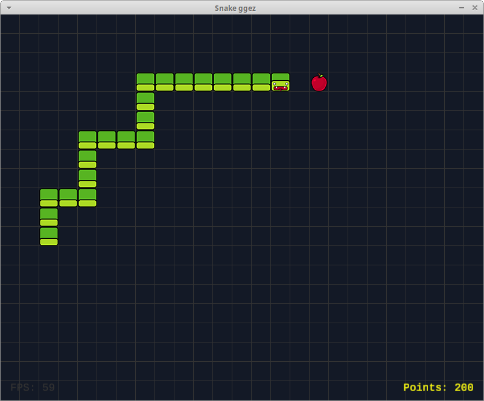

# snake-ggez
A small tutorial on writing a Snake game with Rust and ggez

The tutorial is at [geckoblu-games.github.io/snake-ggez](https://geckoblu-games.github.io/snake-ggez/).



## Installation

### From sources

If you want just play or try it,
follow these instructions to compile (requires [rust](https://www.rust-lang.org/) installed).

1\. Clone the project 
 
 ```
 git clone https://github.com/geckoblu-games/snake-ggez.git && cd snake-ggez
 ```
 
2\. Build the project
 
 ```
 cargo build --release
 ```
 
3\. Once complete, the binary will be located at

```
target/release/snake-ggez
```

4\. Copy the binary in one of the directories listed in your $PATH
